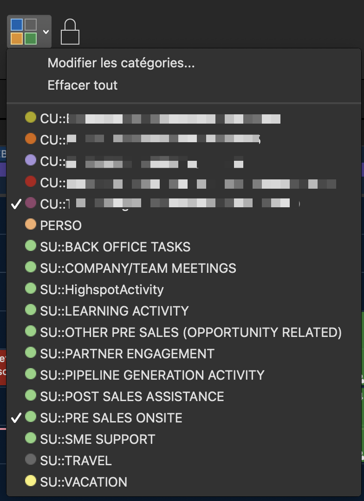

<p align="center">
  
</p>
<p align="center">
    <h1 align="center">SFDC-TASK-IMPORT</h1>
</p>
<p align="center">
    <em><code>Exchange to Salesforce event exporter: Simplify data integration with a single Python script</code></em>
</p>
<p align="center">
	
	
	
	
<p>
<p align="center">
    
    
    <a href="https://github.com/mguyard/SFDC-Task-Import/actions/workflows/lint.yaml" target="_blank">
        
    </a>
    <a href="https://github.com/mguyard/SFDC-Task-Import/actions/workflows/build.yaml" target="_blank">
        
    </a>
<p>
<p align="center">
	<!-- default option, no dependency badges. -->
</p>
<hr>

## 🔗 Quick Links

> - [📍 Overview](#-overview)
> - [📦 Features](#-features)
> - [📂 Repository Structure](#-repository-structure)
> - [🚀 Getting Started](#-getting-started)
>   - [⚙️ Installation](#️-installation)
>   - [🔎 Verifying ExchangeAPI Container](#-verifying-exchangeapi-container)
>   - [🤖 Running SFDC-Task-Import](#-running-SFDC-Task-Import)
>   - [🧩 Parameters](#-parameters)
>   - [🔝 Upgrade Container](#-upgrade-container)
>   - [#️⃣ Identify which version is used](#%EF%B8%8F⃣-identify-which-version-is-used)
> - [🏷️ How to tag events](#%EF%B8%8F-how-to-tag-events)
> - [⤵ Import CSV to Salesforce](#-import-csv-to-salesforce)
> - [🤝 Contributing](#-contributing)
> - [📄 License](#-license)

---

## 📍 Overview

### Objective

This Python script has been developed to facilitate the export of events from Microsoft Exchange into a Salesforce-compatible CSV format. It provides an automated solution for retrieving event data from an Exchange API, validating it against a specified date range, filtering it according to defined criteria, and exporting it as a CSV file ready for import into Salesforce.

> [!NOTE]
>
> This project is under development and meets certain criteria specific to my company. I encourage you to take a look at this project and adapt it to your needs if necessary.

### Motivation

The genesis of this script came from the need to simplify and optimize the tedious process of manually entering activities into Salesforce. Faced with the repetitive task of exporting events from Microsoft Exchange to Salesforce, I felt a compelling need to create an automated tool.

The aim was to put an end to the tedious manual entry of event data, providing an efficient solution for quickly and accurately integrating this crucial information into Salesforce. The script not only saves time by automating the process, but also reduces the risk of errors associated with manual data entry, improving data accuracy and consistency.

In short, this script has been designed to free users from the laborious burden of manual data entry, equipping them with a powerful tool that simplifies the integration of event data into Salesforce in an efficient and reliable way.

---

## 📦 Features

- Retrieve events from the Exchange API.
- Validate event timing according to the specified date range.
- Event filtering based on associated categories.
- Generate a CSV file suitable for import into Salesforce.

This script is designed to be flexible and customizable, offering command-line options for defining various parameters such as date range, maximum number of hours per day, and so on. It aims to simplify the process of integrating event data into Salesforce, providing an efficient tool for users working with both platforms.

---

## 📂 Repository Structure

```sh
└── SFDC-Task-Import/
    ├── .github
    │   └── workflows
    │       ├── build.yaml
    │       └── lint.yaml
    ├── Dockerfile
    ├── import-sfdc-task.py
    └── requirements.txt
```

---

## 🚀 Getting Started

***Requirements***

Ensure that the following dependencies are installed on your system :
- **[Docker Desktop](https://www.docker.com/products/docker-desktop)**: `Minimal version 4.26.1`

> [!TIP]
>     [Docker Desktop Installation Guide for Windows](https://docs.docker.com/desktop/install/windows-install/)
> 
>     [Docker Desktop Installation Guide for MacOSX](https://docs.docker.com/desktop/install/mac-install/)

### ⚙️ Installation

> [!NOTE]
>
> This script relies on the [jcalapi](https://github.com/pschmitt/jcalapi) library, which serves as a crucial component for converting Exchange calendars into an API for seamless interaction. As part of the installation process outlined below, this dependency will be automatically deployed alongside the main script.

```sh
docker create \
--name ExchangeAPI --restart unless-stopped \
-p 7042:7042 \
-e "EXCHANGE_EMAIL=<MyExchageEmailHere>" \
-e "EXCHANGE_USERNAME=<MyExchageEmailHere>" \
-e "EXCHANGE_PASSWORD=<MyExchangePasswordHere>" \
-e "TZ=Europe/Paris" \
pschmitt/jcalapi:latest
docker start ExchangeAPI
```

You can also add another environment variable named PAST_DAYS_IMPORT who can include an integer which is the number of days in past to include by default.
__Otherwise, on the first launch, it will only include events starting on the previous Monday (or today, if it's Monday).__

```sh
docker create \
--name ExchangeAPI --restart unless-stopped \
-p 7042:7042 \
-e "EXCHANGE_EMAIL=<MyExchageEmailHere>" \
-e "EXCHANGE_USERNAME=<MyExchageEmailHere>" \
-e "EXCHANGE_PASSWORD=<MyExchangePasswordHere>" \
-e "PAST_DAYS_IMPORT=15" \
-e "TZ=Europe/Paris" \
pschmitt/jcalapi:latest
docker start ExchangeAPI
```

The main functionality of this script is encapsulated within a Docker container, providing a self-contained and reproducible environment. When you are ready to export events, you will launch this Docker container to execute the script.

> [!IMPORTANT]
>
> During beta-test, please use mguyard/jcalapi:dev instead of pschmitt/jcalapi:latest in docker create command

### 🔎 Verifying ExchangeAPI container

ExchangeAPI container need few seconds to start and collect all events.
To verify if all is working, please execute this command :

```sh
docker container logs ExchangeAPI
``````

Some logs like these confirm if this working :

> Found naive datetime 2023-10-16 13:36:54 on field last_modified_time

> [!TIP]
>
> If you have some issues, you can enable debugs during container creation by adding __-e "DEBUG=True"__


### 🤖 Running SFDC-Task-Import

Use the following command to run SFDC-Task-Import:

```sh
docker run -it --rm \
--name SFDC-Task-Export \
-v "$(pwd)":/export \
-e "TZ=Europe/Paris" \
ghcr.io/mguyard/import-sfdc-task:latest [PARAMETERS]
```

> [!NOTE]
> `-v "$(pwd)":/export` help to define where output will be store. First part `$(pwd)` define the local storage (your actual folder) and second part `/export` define the container path. From the script point of view, all need to be store in /export folder
> 
> You can also replace `$(pwd)` by a absolute path where the output file will be store
> 
>     __For Windows User :__ Please replace `$(pwd)` by `%cd%`

Example :

```sh
docker run -it --rm \
--name SFDC-Task-Export \
-v "$(pwd)":/export \
-e "TZ=Europe/Paris" \
ghcr.io/mguyard/import-sfdc-task:latest \
--sfdc-user-id XXXXXXXXXXXX \
--last-week
```

### 🧩 Parameters

| Flag (Long/Short)             | Default | Description                                                                                         | Type    | Status      |
|-----------------------|-------------------|-----------------------------------------------------------------------------------------------------|---------|-------------|
| `--api-url`/`-u`           | `http://host.docker.internal:7042` | URL and port of the JCALAPI Container API                                                                               | String  | Optional    |
| `--sfdc-user-id`/`-i`      | -                 | Salesforce user ID                                                                    | String  | Required |
| `--this-week`         | -                 | Export events from this week (overrides `--start` and `--end`)               | Flag    | Optional    |
| `--last-week`         | -                 | Export events from last week (overrides `--start` and `--end`)               | Flag    | Optional    |
| `--last-month`        | -                 | Export events from last month (overrides `--start` and `--end`)                      | Flag    | Optional    |
| `--start`/`-s`             | `today date`                 | Start date in YYYY-MM-DD format (must be used with `--end`)                                | String  | Optional    |
| `--end`/`-e`               | `today date`                 | End date in YYYY-MM-DD format (must be used with `--start`)                                | String  | Optional    |
| `--max-hours-by-day`  | `8`              | Maximum number of hours allowed per day                                                         | Integer | Optional    |
| `--morning-hour`      | `8`               | Start hour of the day used in duration calculation                                   | Integer | Optional    |
| `--evening-hour`      | `19`              | End hour of the day used in duration calculation                                     | Integer | Optional    |
| `--output`/`-o`            | `/export/sfdc_task.csv`   | Output CSV file name and path                                                             | String  | Optional    |
| `--export-all`/`-a`        | -                 | Export all events from Exchange, including those without SFDC Task subject                        | Flag    | Optional    |
| `--verbose`/`-v`           | -                 | Verbose mode (displays detailed information during execution)                             | Flag    | Optional    |

> [!TIP]
>
> To find your Salesforce user ID, you can go to the settings of your profile and navigate to "Advanced User Details". In the "Application" section, you will find a field called User ID (18 characters).
> 
> You can simplify the use of this command by using aliases that include your default settings.
> 
> In MacOSX, you can easy doing this by adding this in `~/.zshrc` or create a doskey alias on Windows.


```sh
alias sfdc-export='docker run -it --rm --name SFDC-Task-Export -v ~/Downloads/:/export ghcr.io/mguyard/import-sfdc-task:latest --sfdc-user-id XXXXXXXXXXXX'
```


```sh
doskey sfdc-export='docker run -it --rm --name SFDC-Task-Export -v "%cd%"/:/export ghcr.io/mguyard/import-sfdc-task:latest --sfdc-user-id XXXXXXXXXXXX'
```

> [!NOTE] 
> Only --sfdc-user-id is required. If no other parameters are defined, export will be on the actual day only. If you need an export on different dates, please use `--start` and `--end` or one of `--last-week` `--last-month`
> 
> Weekends are automatically excluded. If needed, please use `--export-all`

### 🔝 Upgrade Container

To upgrade, before [running script](#-running-SFDC-Task-Import), please remove old container image

```sh
docker rmi ghcr.io/mguyard/import-sfdc-task:latest
```

> [!IMPORTANT]
>
> Remember that upgrading create a new container and all cache is lost. So if you don't use PAST_DAYS_IMPORT parameter, at launch, only events between previous monday (today if we are monday) and today are imported.


### #️⃣ Identify which version is used

On you docker host, run this command 

```sh
docker image inspect --format='{{json .Config.Labels}}' ghcr.io/mguyard/import-sfdc-task
```

You will have a JSON output including a `org.opencontainers.image.version` with actual version of your docker image

Last release is : 

---

## 🏷️ How to tag events

To ensure accurate and effective classification of events by the script, it is recommended to utilize Outlook categories when creating or updating events in your calendar. The script employs three types of classifications, with a specific focus on categorizing events based on their subject. There are predefined subject-based categories known to the script:

- **SU::BACK OFFICE TASKS**
- **SU::COMPANY/TEAM MEETINGS**
- **SU::HighspotActivity**
- **SU::LEARNING ACTIVITY**
- **SU::OTHER PRE SALES (OPPORTUNITY RELATED)**
- **SU::PARTNER ENGAGEMENT**
- **SU::PIPELINE GENERATION ACTIVITY**
- **SU::POST SALES ASSISTANCE**
- **SU::PRE SALES ONSITE**
- **SU::SME SUPPORT**
- **SU::TRAVEL**
- **SU::VACATION**

You also need to enhance event classification by including customer or opportunity information using the following formats:

- **Customer Classification:** `CU::<CustomerName>::<SalesforceCustomerID>`
- **Opportunity Classification:** `OP::<OpportunityName>::<SalesforceOpportunityID>`

It's not needed for all subject-based. Please analyze your context.



### Create Categories

You need to create all subject-based categories and useful customer or opportunity ID in outlook.

### How to Assign Categories:

1. **Open the Event in Outlook:**
   - Locate and open the event you want to classify within your Outlook calendar.

2. **Assign Categories:**
   - Navigate to the category section and assign one or more categories based on the desired classifications.

3. **Save Changes:**
   - Close event to ensure the assigned categories are associated with the event.

By adopting these classifications, you provide the script with valuable context, enabling more granular tracking of events based on subjects, clients, and opportunities.


---

## ⤵ Import CSV to Salesforce

To seamlessly import the generated CSV file into Salesforce, we recommend utilizing [dataloader.io](https://dataloader.io/), a data integration service endorsed by Salesforce. This tool provides a user-friendly interface for efficiently importing data into your Salesforce organization.

1. **Access DataLoader.io:** Visit [dataloader.io](https://dataloader.io/) using your preferred web browser.

2. **Login with Company Account:**
    - Log in to DataLoader.io using the Salesforce credentials associated with your company's account.
    - Ensure that you use the Salesforce account credentials that have the necessary permissions for data import.

3. **Specify Salesforce Domain and Environment:**
    - If your Salesforce organization utilizes a custom domain, enter it during the login process.
    - Choose the appropriate environment, such as "Production," to ensure the data is imported into the correct Salesforce instance.

4. **Create a new task:**
    - In DataLoader.io, navigate to the "NEW TASK" section and select "IMPORT".

5. **Initiate CSV Upload and Mapping:**
    - Choose "Insert" as Operation and "Task" as Object
    - Upload CSV file
    - Ensure that the mapping aligns with Salesforce object fields to guarantee accurate data import (only comment isn't mapped - it's only for CSV review).
    - In last step (RUN), please modify "Date format" in "Advanced" section by choosing YYYY-MM-DD 

6. **Run the Data Import Job:**
    - Click on "Save & Run" button, monitoring the progress and addressing any potential errors or warnings.

> For future data uploads, you can streamline the process by editing the existing DataLoader.io task, eliminating the need to recreate it from scratch.


## 🤝 Contributing

Contributions are welcome! Here are several ways you can contribute:

- **[Submit Pull Requests](https://github/mguyard/SFDC-Task-Import/blob/main/CONTRIBUTING.md)**: Review open PRs, and submit your own PRs.
- **[Report Issues](https://github/mguyard/SFDC-Task-Import/issues)**: Submit bugs found or log feature requests for Sfdc-task-import.

<details closed>
    <summary>Contributing Guidelines</summary>

1. **Fork the Repository**: Start by forking the project repository to your GitHub account.
2. **Clone Locally**: Clone the forked repository to your local machine using a Git client.
   ```sh
   git clone https://github.com/mguyard/SFDC-Task-Import
   ```
3. **Create a New Branch**: Always work on a new branch, giving it a descriptive name.
   ```sh
   git checkout -b new-feature-x
   ```
4. **Make Your Changes**: Develop and test your changes locally.
5. **Commit Your Changes**: Commit with a clear message describing your updates.
   ```sh
   git commit -m 'Implemented new feature x.'
   ```
6. **Push to GitHub**: Push the changes to your forked repository.
   ```sh
   git push origin new-feature-x
   ```
7. **Submit a Pull Request**: Create a PR against the original project repository. Clearly describe the changes and their motivations.

Once your PR is reviewed and approved, it will be merged into the main branch.

</details>

---

## 📄 License

This project is protected under the [GPL-3.0](https://choosealicense.com/licenses/gpl-3.0/) License. For more details, refer to the [LICENSE](https://github.com/mguyard/SFDC-Task-Import/blob/main/LICENSE) file.

[**Return**](#-quick-links)

---
